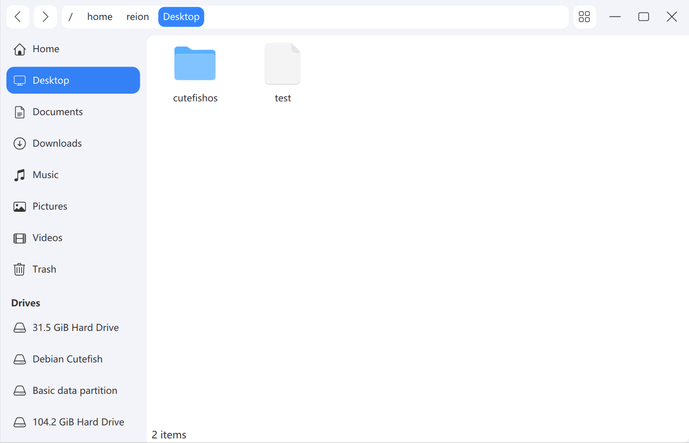

# File Manager

Cutefish File Manager, simple to use, beautiful, and retain the classic PC interactive design. 



## Dependencies

### Ubuntu

```
sudo apt install equivs curl git devscripts lintian build-essential automake autotools-dev --no-install-recommends

sudo mk-build-deps -i -t "apt-get --yes" -r
```

### Debian

```
sudo apt install build-essential cmake extra-cmake-modules libkf5kio-dev libkf5solid-dev libkf5windowsystem-dev qtbase5-dev qtbase5-private-dev qtdeclarative5-dev qtquickcontrols2-5-dev qttools5-dev qttools5-dev-tools
```

### ArchLinux

```shell
sudo pacman -S extra-cmake-modules qt5-base qt5-quickcontrols2 taglib kio
```

## Build

```shell
mkdir build
cd build
cmake -DCMAKE_INSTALL_PREFIX:PATH=/usr ..
make
```

## Install

```shell
sudo make install
```

## License

This project has been licensed by GPLv3.
